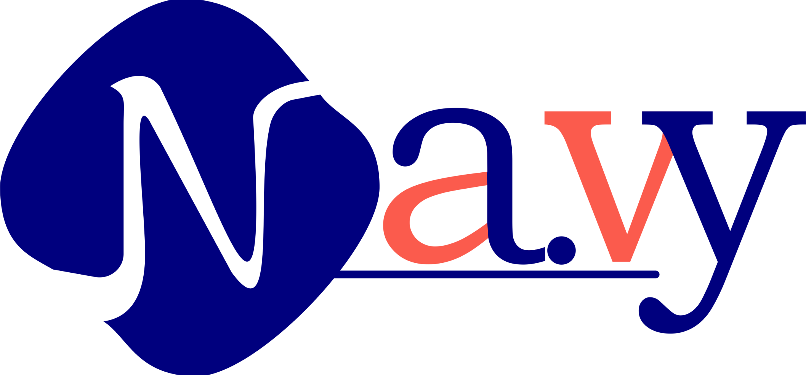

<h1 align="center">Navy Mobile App</h1>

O aplicativo móvel oficial da Navy, desenvolvido em Flutter.

<h2> Sobre o Projeto:</h2>
Este repositório contém o código-fonte do aplicativo Navy Mobile, uma plataforma [descreva o objetivo principal do app, por ex: "para gerenciamento de serviços", "de reservas online", "de comunidade", etc.].

O objetivo é fornecer uma experiência de usuário fluida, rápida e nativa em dispositivos Android e iOS, utilizando o poder do Flutter.

<h2> Funcionalidades</h2>
O aplicativo já conta com as seguintes funcionalidades:
Autenticação: Sistema de Login e Logout seguro.
Gerenciamento de Perfil: O usuário pode visualizar seus dados.
<ul>
<li>Configurações:</li>
    <li>Configuração de Conta (Página /edit).</li>
    <li>Configuração de Notificações.</li>
    <li>Envio de Feedback.</li>
<li>Páginas de Informação:</li>
    <li>Sobre Nós (com logo da empresa).</li>
    <li>Perguntas Frequentes (FAQ).</li>
<li>Tema: Suporte a Tema Claro/Escuro (controlado pelo AppController).</li>
</ul>

<h2>🛠️ Tecnologias Utilizadas</h2>
Este projeto foi construído utilizando as seguintes tecnologias:
<ul>
    <li>Flutter - O SDK de UI do Google para criar belos aplicativos compilados nativamente.</li>
    <li>Dart - A linguagem de programação otimizada para aplicativos em múltiplas plataformas.</li>
    <li>shared_preferences - Para persistência local de dados simples (como token de autenticação).</li>
    <li>Gerenciamento de Estado Nativo - Utilizando </li><li>ChangeNotifier (AppController) para gerenciar o estado global (tema, login).</li>
</ul>

<h2>Começando</h2>
Para executar este projeto localmente, siga os passos abaixo.
Pré-requisitos
    Você precisa ter o Flutter SDK (versão 3.x ou superior) instalado.
    Um editor de código, como VS Code ou Android Studio.
    Um emulador de dispositivo ou um dispositivo físico.

Instalação e Execução
<ol>
    <li>Clone o repositório:  
        git clone https://github.com/GabrielViana14/NavyMobileApp </li>
    <li>Navegue até o diretório do projeto:
        cd navy-mobile-app </li>
    <li>Instale as dependências:
        flutter pub get </li>
    <li>Execute o aplicativo:
        flutter run </li>
</ol>
<h2>Estrutura do Projeto (Simplificada)</h2>
lib/   
├── main.dart                # Ponto de entrada, rotas do app 
├── app_controller.dart      # Controlador de estado global (tema, login) 
│ 
├── pages/                   # Contém todas as telas (Widgets) 
│   ├── perfil_page.dart 
│   ├── login_page.dart 
│   ├── about_us_page.dart 
│   ├── faq_page.dart 
│   ├── feedback_page.dart 
│   └── ... 
│ 
├── service/                 # Lógica de negócios e serviços 
│   └── api_service.dart     # Simulação de API, SharedPreferences 
│ 
assets/                      # Imagens, fontes, etc. 
    └── logo/ 
        └── logo_navy_colorido.png 

<h2>Licença</h2>Distribuído sob a licença MIT. Veja LICENSE para mais informações.